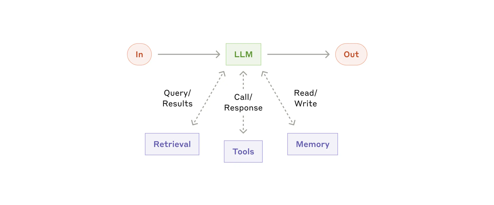
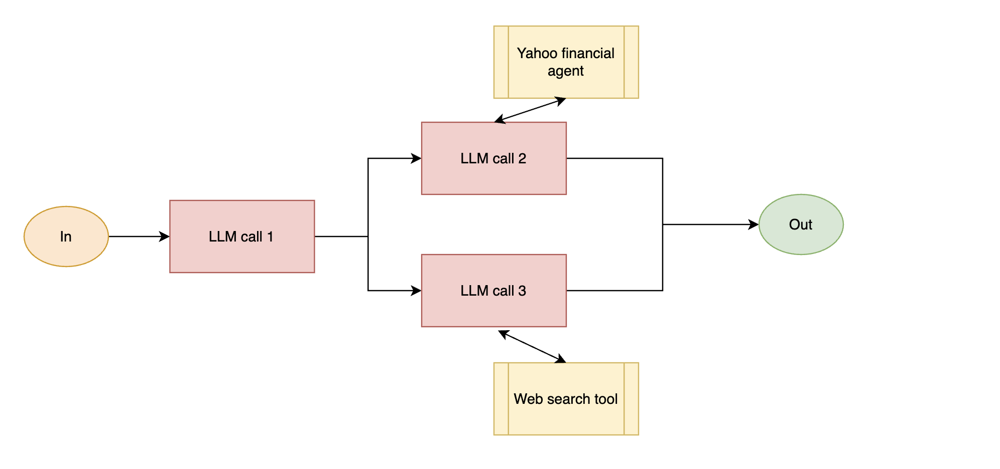

# Finance AI Agent Project

A Python-based project that compares AI agents from different providers (Groq and OpenAI) for financial analysis tasks. The project includes two main scripts: one for single-agent analysis and another for multi-agent team collaboration.


## Theory
In this theory section, we’ll explore the common patterns for agentic systems. We'll start with our foundational building block—the augmented LLM—and progressively increase complexity, from simple compositional workflows to  autonomous agents.



*Image source: [Anthropic - Building Effective Agents](https://www.anthropic.com/engineering/building-effective-agents)*

### Building block: The augmented LLM

The basic building block of agentic systems is an LLM enhanced with augmentations such as retrieval, tools, and memory. Our current models can actively use the augmentation of using the tools and determining what information to retain. Further, these tools act as a independent agents and can work in parallel to each other to retrieve information and provide a response.

In this project, the usage of single agent and multi-agent team is compared. In the single agent case, the agent is using the Yahoo Finance tools to retrieve information from the Yahoo Finance API provided as a inbuild function from the PHI data and provide a response according to the user query about the stock provided by the user. In the multi-agent case, the one agent is using the tools to retrieve information from the Yahoo Finance API and another agent is using the tools to latest web information from the duckduckgo API and provide a response of the latest web information about the stock provided by the user.




As together, we make this as LLM enhanced agentic method to retrieve information from the Yahoo Finance API and provide a response of the latest web information about the stock provided by the user. But this is not the end of the story. As said in this block post [Anthropic - Building Effective Agents](https://www.anthropic.com/engineering/building-effective-agents)*, we can make this as a autonomous agent to retrieve information from the Yahoo Finance API and provide a response of the latest web information about the stock provided by the user and connecting to the appropriate stock broker to place the order when the certain conditions are met. This make a complete autonomous agent for the stock information and trading but there should be a human in the loop to watch this process as it's still in the developemnt phase.
## Project Structure

```
ai_agent_project/
├── .env                    # Environment variables (not in version control)
├── .gitignore
├── pyproject.toml          # Project dependencies
├── requirements.txt        # Python dependencies
├── src/
│   ├── __init__.py
│   ├── single_agent.py     # Single agent implementation
│   ├── two_agents.py       # Multi-agent team implementation
│   └── utils/
│       ├── __init__.py
│       └── logger.py       # Logging configuration
│       └── images/         # Images for documentation
└── responses/             # Directory for agent responses (if saved manually)
```

## Setup Instructions

### Prerequisites

- Python 3.10+
- API keys for:
  - Groq
  - OpenAI

### Environment Variables

Create a `.env` file in the project root with the following variables:

```bash
# Required API Keys
OPENAI_API_KEY=your_openai_api_key_here
GROQ_API_KEY=your_groq_api_key_here

# Optional: Logging configuration
LOG_LEVEL=INFO
LOG_FILE=ai_agent.log
```

## Available Scripts

### Single Agent Analysis (`single_agent.py`)

A simple implementation that uses either Groq or OpenAI's model to analyze stocks.

**Features:**
- Single AI agent implementation
- Supports both Groq and OpenAI models
- Basic financial analysis using yfinance
- Response logging and saving

**Usage:**
```bash
python src/single_agent.py
```

### Multi-Agent Team (`two_agents.py`)

Implements a team of specialized agents working together:
1. **Web Agent**: Handles web searches using DuckDuckGo
2. **Finance Agent**: Handles financial data using yfinance

**Features:**
- Multiple specialized agents working in parallel
- Collaborative problem solving
- Integrated web search and financial analysis
- Response logging and saving

**Usage:**
```bash
python src/two_agents.py
```

## API Key Management

### Obtaining API Keys

1. **OpenAI API Key**:
   - Visit: https://platform.openai.com/api-keys
   - Create a new secret key
   - Add it to your `.env` file as `OPENAI_API_KEY`

2. **Groq API Key**:
   - Visit: https://console.groq.com/keys
   - Create a new API key
   - Add it to your `.env` file as `GROQ_API_KEY`

### Rate Limits

- **OpenAI**: Varies by account tier
- **Groq**: 
  - Free tier: 100,000 tokens/day
  - Monitor usage at: https://console.groq.com/usage

## Development

### Setting Up Development Environment

1. Create and activate a virtual environment:
   ```bash
   python -m venv venv
   source venv/bin/activate  # On Windows: venv\\Scripts\\activate
   ```

2. Install dependencies:
   ```bash
   pip install -r requirements.txt
   ```

### Running Tests

```bash
pytest tests/
```


## Contributing

1. Fork the repository
2. Create your feature branch (`git checkout -b feature/AmazingFeature`)
3. Commit your changes (`git commit -m 'Add some AmazingFeature'`)
4. Push to the branch (`git push origin feature/AmazingFeature`)
5. Open a Pull Request

Comparsion of the free open source available LLM model and OPENAI's paid LLM model for the ai agentic development